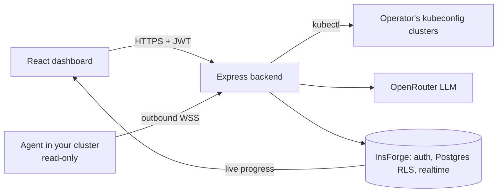

# AI Kubernetes Agent

Troubleshoot Kubernetes with AI — an **on-demand troubleshooting system**.
Click "Investigate Cluster", the backend inspects the cluster, an LLM reasons
over the findings, and you get a root cause plus a suggested fix.

Sign in, **connect any Kubernetes cluster with one command** (a small
read-only agent that dials out — nothing exposed), watch live investigation
progress, and browse past investigations. Every user sees only their own
clusters and history (InsForge auth, Postgres RLS, realtime).

Live: https://ai-k8s-agent.duckdns.org

## Add any cluster

1. Dashboard → **+ Add cluster** → give it a name.
2. Run the command it shows (Git Bash / Linux / macOS), with `kubectl` pointed
   at the cluster:

   ```bash
   curl -sSL https://ai-k8s-agent.duckdns.org/install.sh | bash -s -- --token aika_...
   ```

3. The card turns **Connected**; click it to investigate.

| Option | Effect |
| --- | --- |
| `--namespaces shop,payments` | Read only these namespaces (Roles instead of a ClusterRole) |
| `--dry-run` | Print every object it would create; change nothing |
| `--uninstall` | Remove the agent and its permissions |
| `--image <ref>` | Use a specific agent image |

The agent (`ghcr.io/pushkal-vashishtha/aika-agent`) runs as non-root with a
read-only filesystem and `list` permissions only, plus `get` on pod logs (no Secrets or
ConfigMaps). It redacts secrets before evidence leaves the cluster, and the
backend redacts again. Only a hash of the token is stored; **Rotate** replaces
it and disconnects the old agent, and removing the card revokes it.

## Objective

Debugging Kubernetes is hard: the evidence for a single failure is scattered
across pods, logs, events, deployments, and services, and reading it takes an
experienced SRE. The objective of this project is to compress that skill into
one button — **investigate a live cluster the way a senior engineer would**:
gather structured evidence with kubectl, correlate it with an LLM, and return
a root cause, a concrete fix, and the exact kubectl commands to apply.

Aims:

- **Reduce mean-time-to-diagnosis** from "grep five kubectl outputs" to one
  click and ~40 seconds.
- **Make cluster debugging accessible** to engineers who don't live in
  kubectl all day — the diagnosis is written in plain language.
- **Stay on-demand, not always-on** — this is deliberately *not* a
  controller/operator. A human clicks Investigate; nothing watches or mutates
  the cluster in the background, and the agent only ever *reads* (the fix is
  suggested, never auto-applied).
- **Prove the agentic-AI pattern**: deterministic evidence collection +
  LLM reasoning + graceful fallbacks, with zero scenario-specific code.

## Architecture



Evidence (pods, logs, events, deployments, network) is collected by the shared
`packages/collector` — inside the cluster by the agent, or by the backend via
kubectl — redacted, capped, and handed to the LLM, which returns a root cause,
fix, kubectl commands and confidence.

See [docs/architecture.md](docs/architecture.md) for the full design and
security model.

## Project structure

```text
ai-kubernetes-agent/
├── packages/
│   ├── collector/      # Evidence collection + redaction (shared by backend and agent)
│   └── protocol/       # Agent <-> backend wire contract
├── agent/              # In-cluster agent (published to GHCR)
├── install/install.sh  # One-line installer served at /install.sh
├── migrations/         # InsForge Postgres schema, RLS, realtime triggers
├── backend/            # Express API (port 8000)
│   └── src/
│       ├── api/        # Routes, auth middleware, rate limiter
│       ├── agents/     # WebSocket hub for agents, token minting
│       ├── core/       # Config + logging + InsForge admin client
│       ├── ai/         # Prompt, OpenRouter client, reasoner
│       ├── services/   # Clusters, evidence sources, investigations, history
│       └── models/     # Shared data shapes
├── frontend/           # React + TypeScript + Tailwind (port 3000)
│   └── src/
│       ├── components/
│       ├── services/   # axios API client
│       ├── hooks/      # React Query hooks
│       └── types/
├── docs/
├── prompts/
├── test-scenarios/     # Intentional failure manifests for demo/testing
├── docker-compose.yml
└── README.md
```

## Quick start (Docker)

```bash
docker compose up --build
```

Then open:

- Frontend: http://localhost:3000
- Backend health: http://localhost:8000/health

Expected health response:

```json
{ "status": "healthy", "service": "ai-kubernetes-agent" }
```

## API

| Method | Path           | Auth   | Description                                          |
| ------ | -------------- | ------ | ---------------------------------------------------- |
| GET    | `/health`      | none   | Service health check                                 |
| GET    | `/clusters`    | Bearer | Your clusters with status, `available`, agent version, `update_available` |
| POST   | `/clusters`    | Bearer | Add an agent cluster `{ "name" }`; returns the one-time `agent_token` |
| DELETE | `/clusters/:id` | Bearer | Remove a cluster; disconnects and revokes its agent |
| POST   | `/clusters/:id/rotate-token` | Bearer | New agent token; the old agent is disconnected |
| POST   | `/investigate` | Bearer | Investigate `{ "cluster_id" }` and return diagnosis + evidence |
| GET    | `/install.sh`  | none   | Agent installer with this server's URL filled in |
| WS     | `/agent/connect` | agent token | Agent connection (outbound from the cluster) |

Authenticated routes expect an InsForge access token:
`Authorization: Bearer <token>`. Users only ever see their own clusters
(`404` otherwise). `POST /investigate` still accepts the legacy
`{ "context": "<name>" }`; it returns `503` when the cluster's agent is offline
and `429` with `Retry-After` past the per-user limit (one at a time, 20 per
hour by default).

`POST /investigate` collects structured evidence with kubectl (like a junior
DevOps engineer gathering facts), then has the AI agent reason about it like
a Senior Kubernetes SRE — correlating pods, logs, events, deployments, and
networking into a root cause with a suggested fix:

```json
{
  "status": "success",
  "diagnosis": {
    "root_cause": "payment-service is crash-looping because DATABASE_URL is missing",
    "explanation": "CrashLoopBackOff + fatal log line + 0/1 available replicas …",
    "fix": "Add the missing DATABASE_URL environment variable …",
    "kubectl_commands": ["kubectl set env deployment/payment-service DATABASE_URL=…"],
    "prevention": "Validate required env vars in CI …",
    "confidence": 98,
    "confidence_reasoning": "Identical fatal error in current and previous runs …",
    "source": "llm",
    "model": "anthropic/claude-4.5-sonnet-20250929"
  },
  "ai_error": null,
  "investigation": {
    "collected_at": "…",
    "cluster_reachable": true,
    "issues_found": 2,
    "pods":        { "healthy": false, "problematic_pods": ["…"] },
    "logs":        { "collected": 1, "logs": ["…"] },
    "events":      { "findings": ["…"] },
    "deployments": { "unhealthy_deployments": ["…"] },
    "network":     { "issues": ["…"], "dns": { "healthy": true } }
  }
}
```

AI notes:

- The OpenRouter key comes from InsForge and lives in `backend/.env`
  (server-only, never committed, never sent to the frontend).
- If the cluster is unreachable, the diagnosis is produced deterministically
  (`"source": "rule"`) without an LLM call.
- If the LLM is unavailable (missing key, timeout after retries), the response
  still returns the investigation evidence with `diagnosis: null` and a
  human-readable `ai_error`.

Every check degrades gracefully: if kubectl is missing or the cluster is
unreachable, the response still comes back with `error` fields explaining
what failed instead of a crash.

### Cluster access

The investigation layer shells out to `kubectl`, so the backend needs a
working kubectl context:

- **Local dev (`npm run dev`)** — uses your normal kubectl config
  (`~/.kube/config`) or `KUBECONFIG_PATH` from `backend/.env`. This is the
  recommended way to develop against kind/minikube/Docker Desktop.
- **Docker** — the backend image ships with kubectl, but the container needs
  a kubeconfig whose server address is reachable from inside Docker
  (kind/minikube default to `127.0.0.1:<port>`, which a container cannot
  reach). Mount one via the commented `volumes` block in
  `docker-compose.yml`. Without it, `/investigate` returns a graceful
  "cluster unreachable" payload.

## Local development (without Docker)

Backend:

```bash
npm install        # from the repo root: installs backend, agent and packages/* (workspaces)
npm run dev        # backend on http://localhost:8000
npm test           # collector, protocol and backend tests
```

Frontend:

```bash
cd frontend
npm install
npm run dev        # http://localhost:3000
```

## Environment variables

Backend (`backend/.env`, see `backend/.env.example`):

| Variable             | Purpose                                                    |
| -------------------- | ---------------------------------------------------------- |
| `PORT`               | API port (default `8000`)                                  |
| `OPENROUTER_API_KEY` | OpenRouter key (provided via InsForge, server-only)        |
| `OPENROUTER_MODEL`   | LLM model id (default `anthropic/claude-sonnet-4.5`)       |
| `KUBECONFIG_PATH`    | Kubeconfig path (optional; defaults to kubectl's own config) |
| `INSFORGE_URL`       | InsForge backend URL (session verification + history)      |
| `INSFORGE_API_KEY`   | InsForge admin key (server-only, never sent to the frontend) |
| `LOCAL_CLUSTER_OWNER` | InsForge user id that owns this backend's kubeconfig clusters (optional) |
| `LOCAL_CLUSTER_HOST` | Name those clusters are registered under (default: hostname) |
| `INVESTIGATE_MAX_PER_HOUR` | Per-user investigation cap (default `20`) |
| `AIKA_REDACT_PATTERNS` | Extra secret regexes to redact (JSON array or one per line) |

Agent (set by `install.sh`): `AIKA_TOKEN`, `AIKA_SERVER`, optional
`AIKA_NAMESPACES` and `AIKA_REDACT_PATTERNS`.

Frontend (`frontend/.env`, see `frontend/.env.example`):

| Variable                 | Purpose                                            |
| ------------------------ | -------------------------------------------------- |
| `VITE_API_BASE_URL`      | Backend API base URL (`http://localhost:8000`)     |
| `VITE_INSFORGE_URL`      | InsForge backend URL (auth, history, realtime)     |
| `VITE_INSFORGE_ANON_KEY` | InsForge anon key (public by design)               |

> Note: the frontend is a Vite React app, so public env vars use the `VITE_`
> prefix (the Next.js-style `NEXT_PUBLIC_` prefix does not apply here). In the
> Docker build the value is baked in at build time via a build arg in
> `docker-compose.yml`.

## Test scenarios

`test-scenarios/` contains intentional failure manifests, each verified to
produce the expected AI diagnosis:

| Manifest                      | Failure                    | Expected root cause        |
| ----------------------------- | -------------------------- | -------------------------- |
| `01-crashloopbackoff.yaml`    | Missing env variable       | `DATABASE_URL` missing     |
| `02-imagepullbackoff.yaml`    | Wrong image tag            | Non-existent image tag     |
| `03-oomkilled.yaml`           | Memory limit too low       | Container exceeds limit    |
| `04-selector-mismatch.yaml`   | Wrong service selector     | Selector matches no pods   |
| `05-deployment-failure.yaml`  | Readiness probe wrong port | Rollout stuck, probe fails |

For a step-by-step live-demo script (timing, narration tips, gotchas), see
[docs/demo-runbook.md](docs/demo-runbook.md). To learn the whole system end
to end — architecture diagrams, design decisions, deployment/CI-CD
internals, and every war story — see
[docs/project-mastery.md](docs/project-mastery.md) with
[docs/interview-prep.md](docs/interview-prep.md) as the Q&A drill companion.

```bash
kubectl create namespace failure-lab
kubectl apply -f test-scenarios/01-crashloopbackoff.yaml
# ...click Investigate in the dashboard...
kubectl delete namespace failure-lab
```

## What we built, and how

The project was built in five verified stages:

1. **Foundation** — Express (ESM) backend + Vite/React/TypeScript/Tailwind
   frontend in a monorepo, Dockerized with compose.
2. **Kubernetes investigation layer** — a kubectl executor built on
   `execFile` (argument arrays, no shell → no command injection) feeding five
   inspectors: pods, logs, events, deployments, network. Output is a single
   structured evidence payload; every section degrades to an `error` field
   instead of crashing when the cluster is unreachable.
3. **AI reasoning** — the evidence payload goes to an LLM (OpenRouter,
   `anthropic/claude-sonnet-4.5`, temperature 0, retries + timeout) prompted
   to reason like a senior SRE. If the cluster is unreachable the diagnosis
   is produced by deterministic rules with **no LLM call at all**; if the LLM
   fails, the raw evidence still comes back with a readable `ai_error`.
4. **Dashboard + platform** — InsForge email/OTP auth (backend verifies every
   bearer token server-side), investigation history in Postgres with
   row-level security (users read only their own rows; the backend writes via
   an admin key that never reaches the browser), and **live progress over
   realtime channels published by a database trigger** — the backend just
   updates a row, the DB pushes the event.
5. **Reliability + multi-cluster** — every kubeconfig context is listed as a
   clickable cluster card; `--context` is threaded through every kubectl
   call; friendly error mapping (timeouts, unreachable backend, expired
   session); five intentional failure scenarios verified end-to-end
   (95–98% diagnosis confidence).
6. **Deployment** — EC2 + k3s + Caddy (HTTPS on DuckDNS), GitHub Actions
   CI/CD with health-checked deploys and instant frontend rollback.
7. **Multi-tenant, any cluster** — clusters owned per user with RLS; the
   collector extracted into a shared package; an outbound WebSocket agent with
   hashed tokens, a one-line installer (restricted Pod Security, read-only
   RBAC, optional namespace scope), live status over realtime, token rotation,
   secret redaction in the cluster and on the backend, evidence caps,
   per-user rate limits, and an "agent out of date" notice. Built and verified
   phase by phase in
   [docs/multi-tenant-checklist.md](docs/multi-tenant-checklist.md).

## Observations & lessons learned

- **Evidence quality beats prompt cleverness.** Handing the LLM correlated,
  structured facts (pod status + its logs + its deployment's conditions +
  matching events) is what produces 95–98%-confidence diagnoses — not longer
  prompts.
- **One pipeline, five failure classes.** CrashLoopBackOff, ImagePullBackOff,
  OOMKilled, selector mismatch, and stuck rollouts are all diagnosed by the
  same code path; nothing is hardcoded per scenario.
- **Real bug found by testing failure scenarios**: a crash-looping container
  is briefly `Running` between restarts, so status-only checks miss it. The
  fix reads `lastState.terminated` — but that over-triggered on system pods
  that crashed once at node boot, so detection is gated on a restart count
  and a 10-minute recency window. Detection logic needs time awareness, not
  just state awareness.
- **Fail deterministically when you can.** An unreachable cluster needs a
  checklist, not an LLM — the rule-based fallback is faster, free, and never
  hallucinates.
- **Environment gotchas are real DevOps work**: a containerized backend
  cannot reach kind's `127.0.0.1` API server (hence the local dev flow), and
  PowerShell mangles `sh -c` arguments (hence YAML-only scenario seeding).
- **Outbound beats inbound for reaching other people's clusters.** An agent
  that dials out needs no firewall changes, never hands over cluster
  credentials, and can be revoked from the dashboard in one click.
- **Least privilege is a code change, not a YAML change.** Scoping the agent
  to namespaces needed per-namespace listing in the collector and a prompt
  that knows what it could not see — otherwise a Role would have broken every
  investigation.
- **Immutable image tags need an unforgettable version bump.** A missed bump
  once shipped an agent without redaction; a test now keeps every version
  string in sync, and the backend redacts regardless.

## Future scope

- **Horizontal scaling**: a shared store (e.g. Redis pub/sub) so several
  backends can hold agent connections and share rate limits.
- **Approval-gated auto-fix**: one click to apply the suggested kubectl
  commands, with a human confirmation step and audit trail.
- **Metrics evidence**: add `kubectl top` / Prometheus data so resource
  diagnoses cite actual usage numbers.
- **Helm chart** for the agent, alongside the one-line installer.
- **Notifications**: push diagnoses to Slack/Teams; optional scheduled
  health-check investigations.
- **CI/CD**: GitHub Actions running the failure-scenario suite against a
  kind cluster on every PR; image builds to a registry; Helm chart.
- **Cost/latency controls**: model fallbacks, response streaming, per-user
  usage tracking.

## Roadmap

1. ✅ Project foundation
2. ✅ Kubernetes investigation layer (evidence gathering via kubectl)
3. ✅ AI reasoning via OpenRouter (InsForge key) — root cause, fix, confidence
4. ✅ Dashboard: InsForge auth, realtime progress, diagnosis card, history
5. ✅ Integration testing, reliability, multi-cluster picker (kubeconfig contexts)
6. ✅ Deployment: EC2 + CI/CD ([docs/deployment-ec2.md](docs/deployment-ec2.md))
7. ✅ Multi-tenant any-cluster agent ([docs/multi-tenant-checklist.md](docs/multi-tenant-checklist.md))
8. ⏳ Future scope above
