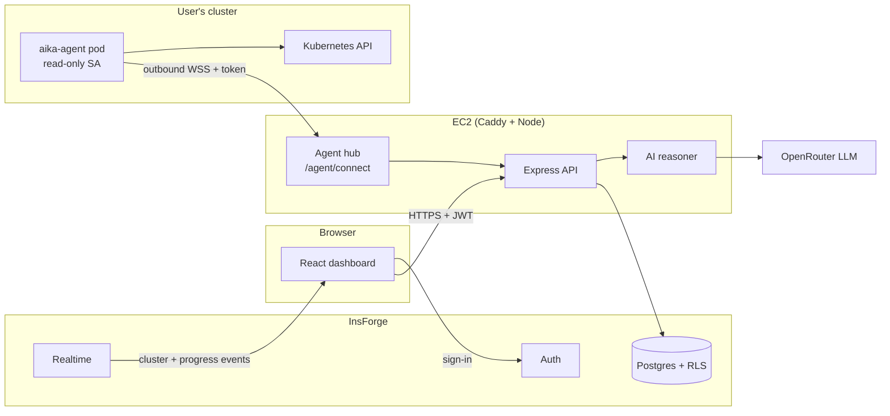
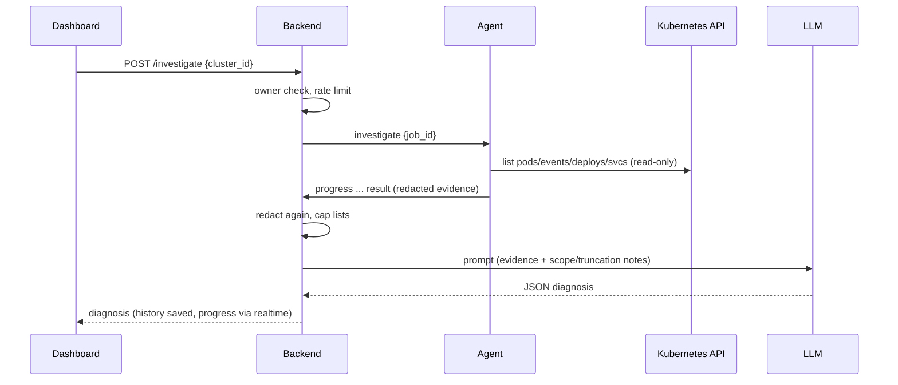

# Architecture

## Overview

The AI Kubernetes Agent is an **on-demand troubleshooting system**, not a
Kubernetes controller or operator. An investigation runs only when a signed-in
user asks for one: evidence is collected from a cluster, secrets are redacted,
an LLM reasons over it, and the user gets a root cause and a suggested fix.

It is **multi-tenant**: every user sees only their own clusters and history,
and a cluster can be reached two ways.

| Mode | How the backend reaches the cluster | Used for |
| --- | --- | --- |
| `agent` | A small read-only agent inside the cluster dials **out** to the backend over WebSocket | Any cluster, anywhere (EKS, GKE, k3s, kind behind NAT) |
| `local` | The backend runs `kubectl` against a kubeconfig on its own machine | The operator's own clusters, and the dev loop |

Nothing in a user's cluster is exposed: the agent only makes an outbound
HTTPS/WSS connection, and its RBAC is read-only.

## Topology

## Investigation flow (agent cluster)

A `local` cluster follows the same flow, with the backend running the
collector itself through `kubectl` instead of asking an agent.

## Components

### `packages/collector` — evidence collection

Shared by the backend and the agent, so evidence has the same shape wherever
it was collected.

| Module | Role |
| --- | --- |
| `client.kubectl.js` | Collector client over the `kubectl` binary (local clusters) |
| `client.api.js` | Collector client over `@kubernetes/client-node` with the pod's ServiceAccount (agent) |
| `namespaces.js` | Namespace-scoped listing for agents installed with `--namespaces` |
| `inspectors/*` | Pods, logs, events, deployments, network/DNS |
| `redact.js` | Built-in secret rules (JWTs, keys, URL passwords, `PASSWORD=`…) plus custom patterns |
| `index.js` | `collectEvidence`: runs the inspectors, caps long lists at 20, redacts, records scope and truncation |

### `packages/protocol` — agent wire contract

Message types (`hello`, `welcome`, `investigate`, `progress`, `result`, …),
close codes (`4001` unauthorized, `4002` protocol too old, `4003` replaced,
`4004` cluster removed, `4005` bad message), `LATEST_AGENT_VERSION`. The
contract only grows; incompatible changes bump `PROTOCOL_VERSION`.

### `agent/` — in-cluster agent

A deliberately simple job runner: one outbound WebSocket, reconnect with
jittered backoff, runs `collectEvidence` when asked, exits on fatal close
codes (revoked token, removed cluster). No watch loops, no write access.
Published as `ghcr.io/pushkal-vashishtha/aika-agent:<version>` (multi-arch).

### `install/install.sh` — installer

Served by the backend at `/install.sh` with the server URL filled in. Creates
namespace `aika-system` (restricted Pod Security), ServiceAccount, Secret
(token), Deployment (non-root, read-only root FS, no capabilities), and either
a read-only ClusterRole or, with `--namespaces a,b`, a read-only Role per
namespace. Also `--dry-run` and `--uninstall`.

### `backend/`

| Folder | Role |
| --- | --- |
| `src/api/` | Routes: `/clusters` (list, add, remove, rotate token), `/investigate`, `/install.sh`, `/health`; JWT auth middleware; per-user investigation limiter |
| `src/agents/` | `hub.js`: WebSocket server, token auth before upgrade, heartbeats, job dispatch; `token.js`: mint/hash `aika_` tokens |
| `src/services/` | Cluster registry, evidence sources (local vs agent), investigation orchestration, history |
| `src/ai/` | Prompt builder, OpenRouter client, reasoner with validated JSON output |
| `src/core/` | Config, logger, InsForge client |

### `frontend/`

React 19 + Vite + Tailwind. Cluster cards with live status, Add cluster and
Rotate token dialogs (install command shown once), investigation progress,
diagnosis card, history table. Signs in with InsForge (Google OAuth).

### `migrations/`

InsForge Postgres schema: `investigations`, `clusters` (owner, mode, status,
host, agent version, token hash), row-level security so users only read their
own rows, and triggers that publish cluster changes to
`clusters:user:<id>` for realtime.

## Security model

- **Tenancy:** every route checks the InsForge JWT; every query is scoped to the
  user; RLS enforces the same in the database.
- **Agent tokens:** `aika_` prefix, shown once, only a SHA-256 hash stored,
  sent in the `Authorization` header (never the URL), checked before the
  WebSocket upgrade. Rotate replaces the token and disconnects the old agent.
- **Least privilege:** `list` on pods, events, services, endpoints, deployments (and nodes cluster-wide) plus `get` on `pods/log`; no watch, no Secrets or ConfigMaps;
  optionally limited to chosen namespaces.
- **Redaction twice:** in the cluster by the agent, and again by the backend,
  so an old or modified agent cannot leak secrets to the LLM or the database.
- **Abuse limits:** one running investigation per user and a per-hour cap
  (`INVESTIGATE_MAX_PER_HOUR`, default 20), `429` with `Retry-After`.
- **Versions:** `update_available` flags agents older than
  `LATEST_AGENT_VERSION`; a test keeps the four version strings in sync.

## Behaviour notes

- The LLM runs at `temperature: 0`. An unreachable cluster gets a rule-based
  diagnosis without an LLM call; an LLM failure still returns the evidence
  with `ai_error` instead of a 500.
- Prompts say when lists were truncated and, for namespace-scoped agents,
  which namespaces the evidence covers, so the model does not guess about
  what it could not see.

## Known limits

- **Single backend instance.** Agent connections and rate limits live in
  process memory. Running two backends needs a shared store (e.g. Redis
  pub/sub to route jobs to the instance holding a cluster's socket).
- **On-demand only.** No continuous watching and no auto-remediation, by design.
