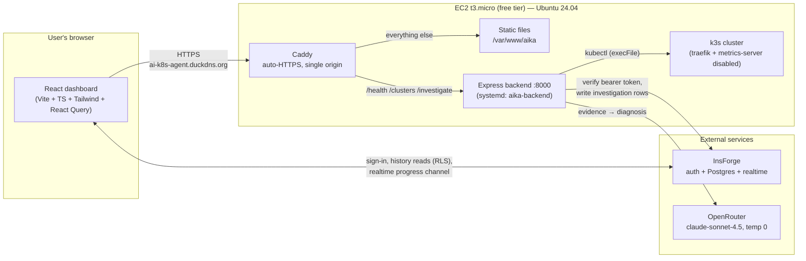
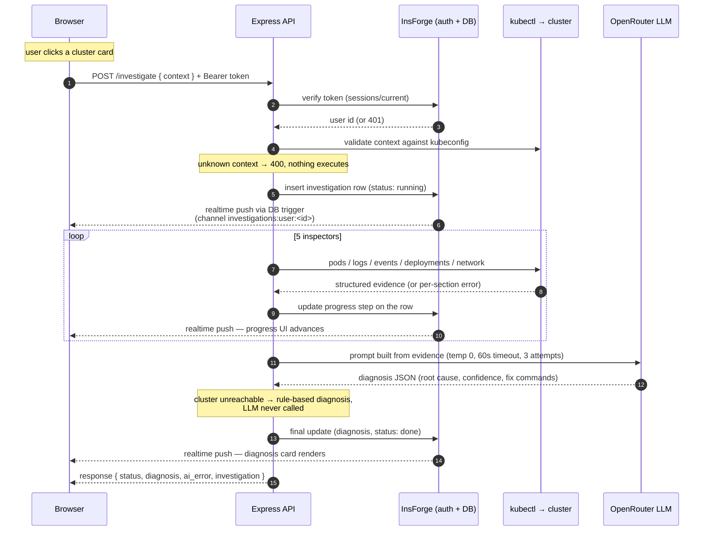
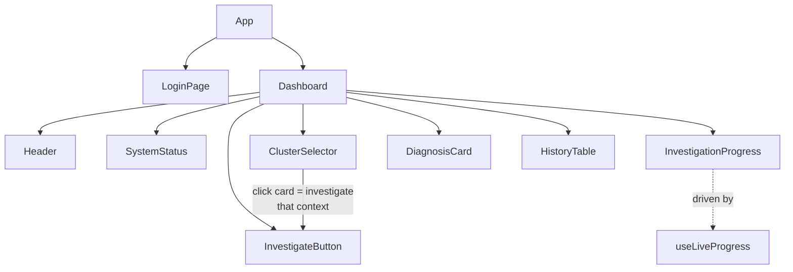
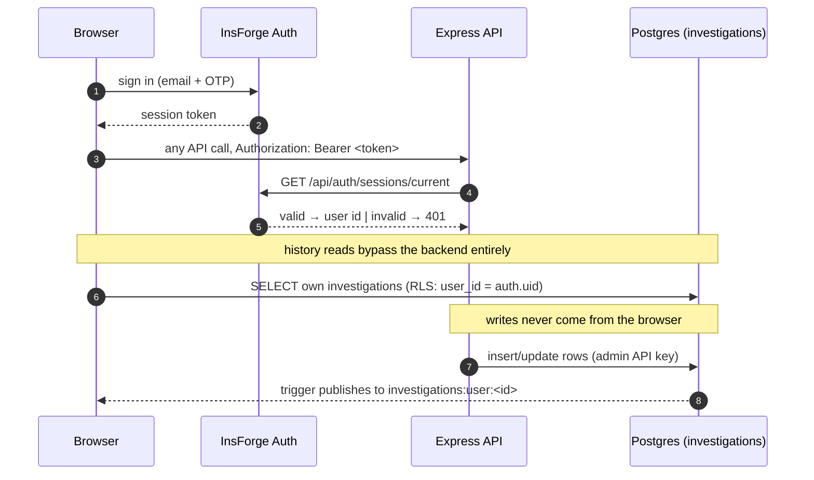
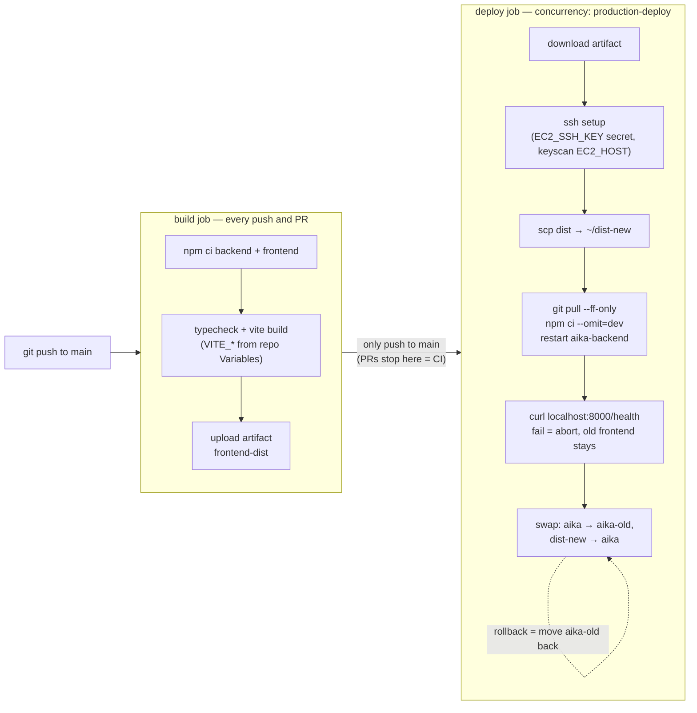

# Project Mastery Guide — AI Kubernetes Troubleshooting Agent

This is the "know it in and out" document: every layer of the system from the
browser to the EC2 box, with diagrams, the design decisions and *why* they were
made, and every real problem hit along the way. Read it top to bottom once,
then use it as a reference while you walk the code.

Companion docs — this guide tells you how the system works; these tell you how
to perform it:

| Doc | Use it for |
|---|---|
| [interview-prep.md](interview-prep.md) | The pitch, Q&A drills, the crash-loop bug story |
| [demo-runbook.md](demo-runbook.md) | The live 5-scenario demo script |
| [deployment-ec2.md](deployment-ec2.md) | The exact production setup you performed |
| [architecture.md](architecture.md) | Original architecture notes |

---

## Part 0 — The preparation strategy

**The explanation ladder.** Interviewers probe at three depths; prepare an
answer at each and know when to switch levels:

1. **30 seconds** — the pitch (memorize it from interview-prep.md).
2. **2 minutes** — the architecture walkthrough: trace one investigation from
   click to diagnosis out loud, naming each layer. Part 2 of this doc is that
   trace as a diagram.
3. **10 minutes** — pick any box in the diagrams here and go deep: why this
   design, what breaks without it, what you'd change at scale.

**The 7-session plan** (a session = 60–90 focused minutes):

| Session | Do this | Success check |
|---|---|---|
| 1 | Read Parts 1–3 here; redraw the architecture diagram from memory | You can draw it on a whiteboard unaided |
| 2 | Backend read-through in the order listed in Part 4, with this doc beside you | You can explain what each file does in one sentence |
| 3 | Frontend read-through (Part 5 order) | You can narrate login → investigate → live progress from the code |
| 4 | Part 6 (auth/data/realtime); open InsForge and look at the real table + trigger | You can explain why the backend never pushes websocket messages |
| 5 | SSH to the EC2 box; trace a request through Caddy → systemd → k3s using Part 7 | You can explain every line of the Caddyfile and the unit file |
| 6 | Part 8 (CI/CD) + Part 9 (war stories); open a real Actions run and follow it | Each war story told in 4 sentences: symptom → cause → fix → lesson |
| 7 | Full dress rehearsal: run the demo-runbook end to end, then answer every interview-prep.md question out loud | No notes needed |

**The teach-back test.** After each session, explain that layer out loud to an
imaginary junior engineer (or record yourself). If you stumble, that's the gap
— reread only that part. Explaining is the skill being interviewed, not
recall.

**War stories beat features.** Interviewers remember "traefik silently stole
ports 80 and 443 from my reverse proxy and here's how I found it" far longer
than any feature list. Part 9 is your ammunition — one story per theme,
rehearsed.

---

## Part 1 — The system at a glance

One sentence: **a web app where you pick a Kubernetes cluster and click
Investigate; the backend gathers evidence with kubectl, an LLM reasons over it
like a senior SRE, and you get a root cause with the exact fix commands — with
progress streamed live to the browser.**

It is deliberately **not** an operator: on-demand, read-only, human-triggered.
A human reviews and applies every fix.



Three trust boundaries worth naming in an interview:

- **Browser ↔ backend**: every API request carries a bearer token that the
  backend re-verifies server-side. The client is never trusted.
- **Backend ↔ cluster**: kubectl runs via `execFile` (no shell), and the only
  user-controlled input (`context`) is validated against the kubeconfig first.
- **Browser ↔ database**: history reads go direct to Postgres but through
  row-level security — users can only see their own rows. Writes come only
  from the backend with an admin key that never ships to the browser.

---

## Part 2 — The investigation flow (know this cold)

Every deep question hangs off this sequence. Practice narrating it.



Key talking points hidden in this diagram:

- **The DB is the message bus.** The backend never manages websockets; it just
  updates a row, and a Postgres trigger publishes to a per-user channel. If
  the backend restarted mid-investigation, no progress updates are lost — the
  row is the single source of truth.
- **Progress arrives twice** (realtime push *and* final HTTP response). The UI
  is driven by realtime; the response is the fallback and the API contract.
- **Two exits without an LLM call**: invalid context (400 before any process
  runs) and unreachable cluster (deterministic rule-based diagnosis).

---

## Part 3 — Repository map

```
ai-kubernetes-agent/
├── backend/          Express, plain JS (ESM), port 8000
├── frontend/         Vite + React 19 + TS + Tailwind v4, port 3000 (dev)
├── test-scenarios/   5 intentionally broken YAML manifests
├── prompts/          The staged build prompts (project history)
├── docs/             This doc + companions
└── .github/workflows/deploy.yml   CI/CD pipeline
```

### Backend — `backend/src/` (read in this order)

| # | File | One-sentence job |
|---|---|---|
| 1 | `server.js` | Entry point — binds port 8000 |
| 2 | `app.js` | Express app: CORS, JSON parsing, mounts routes |
| 3 | `core/config.js` | Env loading (PORT, KUBECONFIG_PATH, OpenRouter + InsForge keys) |
| 4 | `core/logger.js` | Logging |
| 5 | `core/insforge.js` | Server-side InsForge client (admin key) |
| 6 | `api/index.js` | Route registry |
| 7 | `api/health.routes.js` | `GET /health` — the only unauthenticated route |
| 8 | `api/auth.middleware.js` | `requireAuth` — verifies bearer token against InsForge on every request |
| 9 | `api/investigation.routes.js` | `GET /clusters` + `POST /investigate` (both behind requireAuth) |
| 10 | `kubernetes/kubectl.executor.js` | The **only** place kubectl runs: `execFile` + argument arrays, `--context` threading |
| 11 | `kubernetes/cluster.inspector.js` | `kubectl config view -o json` → cluster/context list |
| 12 | `kubernetes/pod.inspector.js` | Pod states incl. the crash-looper `lastState.terminated` logic (the bug story) |
| 13 | `kubernetes/logs.collector.js` | Container logs for suspect pods |
| 14 | `kubernetes/events.analyzer.js` | Warning events timeline |
| 15 | `kubernetes/deployment.inspector.js` | Replica/rollout conditions (`ProgressDeadlineExceeded` etc.) |
| 16 | `kubernetes/network.inspector.js` | Services/endpoints (catches selector mismatches) |
| 17 | `ai/prompt.builder.js` | Evidence → structured prompt (cite evidence, report confidence) |
| 18 | `ai/llm.client.js` | OpenRouter via native fetch: temp 0, 60s timeout, 3 attempts |
| 19 | `ai/reasoner.js` | Orchestrates prompt→LLM→parse; rule-based fallback when cluster unreachable |
| 20 | `services/investigation.service.js` | The conductor: runs inspectors, updates progress rows, calls reasoner |
| 21 | `services/history.service.js` | Investigation row persistence |
| 22 | `models/*.js` | Shapes of investigation + diagnosis payloads |

The layering rule: **routes → services → (kubernetes | ai) → executor/client**.
Nothing skips a layer; the executor is the single choke point for process
execution — that's the injection-safety argument.

### Frontend — `frontend/src/`

| Area | Files | Job |
|---|---|---|
| Entry | `main.tsx`, `App.tsx` | Providers (React Query, Auth); auth gate: LoginPage vs Dashboard |
| Auth | `context/AuthContext.tsx`, `lib/insforge.ts` | InsForge session (email + OTP), token for API calls |
| API | `services/api.ts` | Axios instance: `VITE_API_BASE_URL` + bearer header |
| Services | `health/cluster/investigation.service.ts` | One thin module per endpoint |
| Hooks | `useHealthCheck`, `useClusters`, `useInvestigation`, `useHistory` | React Query wrappers — caching, loading/error states |
| Live progress | `hooks/useLiveProgress.ts`, `lib/steps.ts` | Subscribes to `investigations:user:<id>` realtime channel; 6 step definitions |
| Errors | `lib/errors.ts` | Maps failures (timeout, backend down, expired session) to plain language |
| UI | `components/` | See tree below |



---

## Part 4 — Backend design decisions (the "why" answers)

**Why `execFile` and not `exec`?** `exec` spawns a shell, so any string that
reaches it is a potential command injection. `execFile` passes an argument
array directly to the binary — there is no shell to trick. Combined with
context validation (the one user-supplied value is checked against the
kubeconfig's real context list before anything runs), user input can never
become a command.

**Why five separate inspectors instead of `kubectl get all` → LLM?** Token
cost, noise, determinism. The inspectors pre-correlate evidence (this pod's
logs, its deployment's conditions, its service's endpoints), so the prompt is
small and the confidence is high. This is also the scaling answer: structure
beats raw dumps.

**Why does every inspector return a per-section `error` field instead of
throwing?** Graceful degradation. A cluster that is half-broken still yields
evidence from the sections that work; a fully unreachable cluster yields a
complete "everything errored" payload that triggers the rule-based diagnosis.
One failed section never aborts an investigation.

**Why temperature 0?** Reproducibility. Same evidence should give the same
diagnosis, because the output contains commands a human will run. Creativity
is a liability here.

**Why plain JS backend but TypeScript frontend?** The backend is a thin
orchestrator — its risk is in process handling and error paths, not
type-heavy domain logic. The frontend has real data shapes crossing a network
boundary, which is exactly where types pay for themselves.

**What are the failure layers?** (1) cluster unreachable → deterministic
diagnosis, zero LLM cost; (2) LLM fails after 3 attempts → evidence still
returned with a readable `ai_error`; (3) frontend maps every failure class to
plain language. Three independent layers, each degrades alone.

---

## Part 5 — Frontend design decisions

**Why React Query?** Server state (clusters, history, health) gets caching,
retries, and loading/error states for free — no hand-rolled `useEffect` +
`useState` juggling. Mutation state drives the Investigate button.

**Why does live progress come from the database and not the HTTP response?**
The POST takes ~40s. Instead of polling or holding a websocket to the
backend, the browser subscribes to an InsForge realtime channel scoped to the
user. The backend just writes rows; a DB trigger pushes. Stateless backend,
no lost updates, and history and live progress share one source of truth.

**The auth gate**: `App.tsx` renders LoginPage until AuthContext has a
session; every axios request then carries the bearer token. A 401 (expired
session) is mapped by `lib/errors.ts` to a friendly re-login message, not a
stack trace.

**Env vars**: Vite only exposes `VITE_`-prefixed vars, burned in at **build
time** — which is why production builds need `.env.production`
(`VITE_API_BASE_URL=https://ai-k8s-agent.duckdns.org`) and why the CI build
step injects them from GitHub Variables. A built `dist/` is
environment-specific; you rebuild to retarget, you don't reconfigure.

---

## Part 6 — Auth, data, and realtime (InsForge)



The `public.investigations` table stores: user, **cluster context** (added in
step 05 — each history row records which cluster it targeted), status, the 6
progress steps, evidence, and the final diagnosis. Two security properties to
be able to state precisely:

1. **RLS = users read their own rows only**, enforced in the database, so even
   a direct DB query from a hijacked browser session can't see other users'
   investigations.
2. **The admin key exists only in `backend/.env` on the server** — the browser
   gets the anon key, which is public by design.

Test-account trick worth remembering: signup OTPs go to fake addresses, so
test users are activated by flipping `email_verified` directly in the DB (the
OTPs themselves are bcrypt-hashed and unreadable).

---

## Part 7 — Production topology (AWS free tier)

Live at **https://ai-k8s-agent.duckdns.org** on a single t3.micro (1 GB RAM,
750 free hours/month, 30 GB EBS).

```mermaid
flowchart TB
    U["Browser"] -->|"HTTPS 443"| C
    DNS["DuckDNS<br/>ai-k8s-agent.duckdns.org → current public IP"] -.-> U
    LE["Let's Encrypt"] -.->|auto cert| C

    subgraph EC2["EC2 t3.micro — Ubuntu 24.04, SG: only 22/80/443"]
        C["Caddy :80/:443"]
        C -->|"/health /clusters /investigate"| BE["aika-backend (systemd)<br/>node src/server.js :8000"]
        C -->|"SPA fallback: try_files {path} /index.html"| FS["/var/www/aika (built dist)"]
        BE -->|"KUBECONFIG_PATH"| K["k3s API :6443 (localhost only)"]
        SW["2 GB swapfile"] -.->|"survival on 1 GB RAM"| EC2
    end

    BE --> ORext["OpenRouter"]
    BE --> INSext["InsForge"]
```

### Every free-tier decision, with its why

| Decision | Why (the interview answer) |
|---|---|
| 2 GB swap first, before anything else | 1 GB RAM cannot hold k3s + node + apt at once; without swap the OOM killer takes out random processes during install |
| k3s not full k8s; `--disable metrics-server` | k3s is a single ~512 MB-budget binary; metrics-server is pure overhead for a demo cluster |
| `--disable traefik` — **required on any instance size** | k3s bundles traefik + klipper LB which claim host ports 80/443 and silently steal traffic from Caddy (war story #4) |
| Frontend built on the laptop, `dist/` scp'd up | Vite build OOMs a 1 GB box; the artifact is static files, so build wherever RAM is free |
| No Elastic IP | An EIP is free only while attached to a *running* instance — it bills while you're stopped, which is exactly when a free-tier user stops to save hours. Instead: DuckDNS repoint after each stop/start (cert and domain unaffected) |
| Caddy over nginx | Automatic HTTPS (provisions + renews Let's Encrypt certs) in a 5-line config |
| Single origin (Caddy serves both API and SPA) | No CORS in production, one TLS cert, one domain |
| Backend as systemd unit, not Docker | No container RAM overhead; `Restart=on-failure`, boot ordering after k3s, journald logs for free |
| `WorkingDirectory=backend` in the unit | dotenv resolves `.env` relative to cwd — without this the backend starts with no config (subtle!) |
| SG never opens 8000/6443 | Backend is reachable only through Caddy (TLS + single audited entry); the k8s API stays loopback-only |

### The two config files to know line-by-line

`/etc/caddy/Caddyfile` — exact-path API matcher; everything else is the SPA
with client-side-routing fallback:

```
ai-k8s-agent.duckdns.org {
    encode gzip
    @api path /health /clusters /investigate
    handle @api { reverse_proxy 127.0.0.1:8000 }
    handle {
        root * /var/www/aika
        try_files {path} /index.html
        file_server
    }
}
```

`/etc/systemd/system/aika-backend.service` — the flags that matter:
`After=network-online.target k3s.service` (don't start before the cluster),
`User=ubuntu`, `WorkingDirectory=.../backend` (dotenv), `Restart=on-failure`
with 5s delay.

### Multi-cluster in production

The cluster picker is literally the contexts in the kubeconfig at
`KUBECONFIG_PATH` — zero app-side configuration. Adding a cluster = merge its
kubeconfig (`KUBECONFIG=a:b kubectl config view --flatten > merged`), point
`KUBECONFIG_PATH` at the merged file, restart the unit. Remote-cluster
gotchas: the `server:` URL must be reachable *from EC2*, and its TLS cert
must include that address (`--tls-san`). Details in deployment-ec2.md.

---

## Part 8 — CI/CD pipeline (GitHub Actions)



Design decisions to be able to defend:

- **Production ships exactly what CI verified** — the deploy job reuses the
  build job's artifact instead of rebuilding.
- **PRs get CI without CD**: the deploy job's `if:` gate
  (`push && refs/heads/main`) means a PR runs build only.
- **Health check *before* the frontend swap**: if the restarted backend fails
  `/health`, the script aborts (`set -euo pipefail`) and users keep the old
  working frontend.
- **Instant rollback**: previous build is kept at `/var/www/aika-old` — one
  `mv` restores it.
- **Concurrency group** `production-deploy` with `cancel-in-progress: false`:
  two rapid pushes deploy sequentially, never interleaved.
- **Secrets vs Variables**: only the SSH private key is a Secret; `EC2_HOST`
  and the `VITE_*` values are Variables because they're public by design
  (they're visible in the shipped bundle anyway).
- **Dedicated deploy key, not the AWS .pem**: the ed25519 key exists only for
  CI, added to `authorized_keys`, revocable by deleting one line — the .pem
  stays the break-glass credential.
- **`EC2_HOST` is the DuckDNS name, not the IP** — free-tier stop/start
  changes the IP; pointing CI at the domain means only DuckDNS needs updating.

---

## Part 9 — War stories (symptom → cause → fix → lesson)

Grouped by theme. Pick one per theme and rehearse it in four sentences.

### Code

**1. The crash-looper the agent couldn't see** *(the flagship story — full
narrative in interview-prep.md).* Detection read only current container
state; a crash-looper is briefly `Running` between restarts, so sometimes
nothing looked wrong. Fix: also read `lastState.terminated` — which then
false-positived on every post-reboot system pod carrying an old
crashed-at-shutdown record. Final design: flag only when restarts ≥ 1 **and**
the last failure is within 10 minutes (an active looper always has a recent
failure; backoff caps at ~5 min). Lesson: state machines lie between
transitions, and the false-positive fix matters as much as the
false-negative fix.

**2. The smoke test that raced the server.** Pasting the doc's whole code
block ran `curl` before node bound port 8000 — empty output, looked broken,
nothing was. Fix: `sleep 2` in the doc between start and check. Lesson: docs
that people paste wholesale are scripts; write them with the same care.

### Kubernetes / infra

**3. Traefik stole the ports (caught before it shipped).** Default k3s
bundles traefik + klipper LB, which bind host 80/443 — Caddy would either
fail to bind or, worse, traffic would silently route to traefik's 404.
Reviewed the install flags and added `--disable traefik` before first boot.
Lesson: know your distribution's defaults; "lightweight" bundles still grab
global resources.

**4. A container can't reach `127.0.0.1` on the host.** The Dockerized
backend couldn't reach the kind API server bound to host loopback — loopback
inside a container *is the container*. Options: backend on host (chosen for
dev), kubeconfig with a routable address, or in-cluster deployment. Lesson:
container networking fundamentals, demonstrated with a real symptom.

**5. Boot-residue window.** Within ~10 minutes of a cluster boot, every
system pod carries fresh crashed-at-shutdown records, so the agent (correctly)
diagnoses a node-reboot cascade that drowns a seeded demo scenario. Rule:
start clusters 15 minutes before demos. Bonus: when a *real* reboot happened,
the agent nailed it from the Rebooted event — the "false positive" pattern
was a true positive that day.

### Windows development environment

**6. PowerShell mangled kubectl args.** `kubectl create deployment ... -- sh
-c '...'` from PowerShell silently corrupted the command (container ran bare
`echo`, exit 0 — nothing crashed, scenario invalid). Fix: all failure
scenarios are YAML manifests, never CLI args. Lesson: cross-shell quoting is
a real failure class; declarative files sidestep it.

**7. The .pem that wouldn't lock down.** SSH refused the key
("UNPROTECTED PRIVATE KEY FILE") even after the standard
`icacls /inheritance:r /grant:r` — because two ACEs were *explicit*, not
inherited, and survived. Fix: remove them by name
(`icacls ... /remove "NT AUTHORITY\Authenticated Users" /remove "BUILTIN\Users"`).

**8. `ssh-keygen -N '""'` made a passphrase of two quote characters.**
PowerShell's quoting passed literal `""` as the passphrase, so CI could never
use the key non-interactively. Fix: generate via `cmd /c '... -N "" ...'`.

**9. The invisible CRLF that broke CI auth.** Piping the public key through
PowerShell (`Get-Content | ssh "cat >>"`) appended `\r` to the line in
`authorized_keys`; sshd silently rejects such keys — auth just fails, no
log hint. Fix: `scp` the `.pub` file and append server-side; `sed -i
's/\r//g'` to repair. Lesson: line endings are protocol; "the same text" is
not the same bytes.

### CI/CD

**10. GitHub's runners couldn't SSH in.** First pipeline run: build green,
deploy dead at `ssh-keyscan`. The security group allowed SSH from "My IP"
only — GitHub-hosted runners come from ever-changing IPs. Fix: opened 22 to
0.0.0.0/0, defensible because auth is key-only; named the stricter
alternatives (SSM Session Manager, or an API step that temp-allowlists the
runner IP then revokes). Lesson: diagnose from *which step* died, and always
know the harder-but-better option.

### Cost / AWS

**11. The Elastic IP trap.** The "obvious" fix for changing IPs bills
precisely when a free-tier user stops the instance to save hours. Chosen
design: no EIP; update DuckDNS after each start. Lesson: free-tier
engineering means reading the billing conditions, not just the feature list.

---

## Part 10 — Cheat sheet

**Numbers**

- **5** verified failure classes, **0** scenario-specific code paths
- **95–98%** diagnosis confidence; **~40s** end-to-end (~6s evidence, ~33s LLM)
- **6** live progress steps; **2** auth-protected endpoints (+1 open `/health`)
- **1** LLM call per investigation; **0** when cluster unreachable
- **1 GB** RAM + **2 GB** swap; **3** open ports (22/80/443); **$0** monthly

**The stack in one breath**: React 19 + TypeScript + Tailwind v4 + React
Query on Vite → Express (plain JS, ESM) → kubectl via execFile → OpenRouter
(claude-sonnet-4.5, temp 0) → InsForge (auth + Postgres/RLS + realtime) →
k3s on EC2 t3.micro behind Caddy on DuckDNS → GitHub Actions CI/CD.

**Commands you might be asked to produce on the spot**

```bash
# What's live in the cluster picker
kubectl config view -o json          # what GET /clusters runs under the hood

# Server operations
sudo systemctl status aika-backend   # backend health (q exits the pager!)
journalctl -u aika-backend -f        # live backend logs
sudo systemctl reload caddy          # after Caddyfile edits

# Deploy verification
curl -s https://ai-k8s-agent.duckdns.org/health
# → {"status":"healthy","service":"ai-kubernetes-agent"}

# Instant frontend rollback
sudo rm -rf /var/www/aika && sudo mv /var/www/aika-old /var/www/aika

# Seed the demo failure
kubectl apply -f test-scenarios/02-imagepullbackoff.yaml
```

**Future-scope answers, ranked**: approval-gated auto-fix → CI e2e suite
(kind inside GitHub Actions asserting on diagnoses) → in-cluster deployment
with ServiceAccount RBAC (Path C) → investigation queue + evidence caching
for scale.
